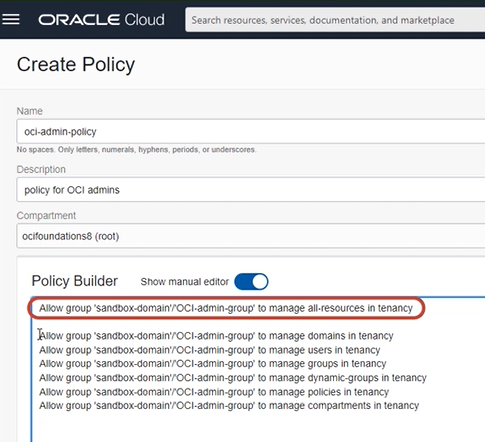

# Oracle Cloud Infraestructure Foundations ☁️

Dentro de este repositorio podrán encontrarse notas, recursos extra y/o prácticas referentes al curso [Oracle Cloud Infraestructure Foundations](https://mylearn.oracle.com/component/-/108432/166230) **(OCI)**. :shipit: 

<h2> OCI Architecture ⚙️ </h2>

♦️ Conceptos básicos:
    
* **Región:** Es un área localizada geográficamente que consta de uno o más _dominios de disponibilidad_.

* **Dominios de disponibilidd:** (O medios de disponibilidad) Son uno o más _centros de datos tolerantes a fallos_ que se ubican dentro de _una región_ que se conectan entre sí por una red de banda ancha.

* **Dominios de errores:** Es una agrupación de HW e infraestructura dentro de un _dominio de disponibilidad_ para proporcionar anti-afinidad. También conocidos como centros de datos lógicos.

♦️ **Para elegir una región** 
 1) Elegir la región más cercana a los usuarios 
     * Latencia baja
     * Rendimiento alto
 2) Requisitos de residencia y conformidad de datos
 3) Disponibilidad del servicio
    

<h2> Identity and Access Management 👥 <h/2>

📝 **IAM**

Conocido como Control de Acceso Detallado o Servicio de Control de Acceso basado en roles.

* AuthN: Autenticación > lidida con la identidad o _quién es alguien_

* AuthZ: Autorización > lidia con el permiso o _lo que alguien puede hacer_

* Dominios de identidad: Contenedor para usuarios de grupos 

📝 **Compartments**

El compartimento raiz es una construcción lógica donde se pueden mantener todos los recursos en la nube.

* Se crean para aislamiento y control de acceso

* Cada recursp que se crea pertenece a un único compartimento

* Se pueden escribir políticas para evitar que los usuarios accedan a recursos de una región específica.

* Todos los compartimentos que se crean son globales y están disponibles en todas las regiones a las que se tenga acceso

* Se pueden crear compartimentos anadidos

📝 **AuthN and AuthZ**

Un principal es una entidad de IAM que puede interactuar con recursos de OCI. Existen 2 tipos de principales:
    * Los usuarios: Las personas que inician sesión en la consola de CLI o SDK, seres humanos que realmente utilizan los recursos en la nube.
    * Los recursos

* Autenticación o AuthN: Claves de firma de API (públicas y privadas), los tokens que son cadenas de token generadas por Oracle.

* Autorización o AuthZ: Se ocupa de los permisos y de averiguar qué permisos tiene. En OCI se realiza mediante políticas de IAM. Las políticas se pueden asociar a un compartimento o se pueden asociar a un arrendamiento. 

* Niveles de Verbs: Administrador/Manage, Uso/Use, Lectura/Read e Inspección/Inspect.

📝 **Tenancy Setup**

Tenancy Admin > OCI Admin > OCI-admin-groups > Policies > name-compartment

Mejores prácticas:
1) No usar la cuenta de admin de arrendamiento para operaciones diarias.
2) Crear compartimentos dedicados para aislar recursos
3) Aplicar el uso de la autenticación multifactor

Ejemplo para otorgar permisos de admin a un grupo de administradores de OCI:
    

    

    

<h2> Networking 🌐📡 <h/2>

📝 **VCN Introduction**

Una _red virtual en la nube_ (Virtual Cloud Network - VCN) es una red privada definida por sw que se crea en Oracle Cloud.
    
* Se utiliza para la comunicación segura.
* Vive en una región de OCI. Se trata de un servicio regional.
* Tiene alta disponibilidad, escalabilidad y seguridad.
    
Internet Gateway: Se trata de una puerta de enlace que permita una ampliación masiva, una alta disponibilidad y que se utiliza para la comunicación con cualquier elemento de Internet.
    
📝 **VCN Routing**
    
Enrutamiento de OCI. La VCN utiliza _tablas de rutas_ para enviar tráfico fuera de la VCN a Internet, redes locales o a las VCN con intercambio de tráfico, y analiza cada uno de dichos escenarios.     
    
📝 **VCN Security**
    
Lista de seguridad. Reglas de firewall asociadas a una subred y aplica a todas las instancias de la subred.
    
Consta de reglas que especifican el tipo de tráfico permitido dentro o fuera de la subred. Esto se aplica a una instancia determinada, tanto si si se está hablando con otra instancia VCN como un host fuera de la VCN.
    
Firewall rules:
    
1) Estas reglas pueden tener estado o no tener estado.
2) El tráfico pasa de la primera subred a la segunda subred.
    
Grupos de seguridad de red o NSG: Se trata de una construcción muy similar como lista de seguridad, pero la diferencia clave es que se aplican sólo a un juego de tarjetas de interfaz de red virtual en una única VCN.
    
Los NSG pueden ser el origen o destino de las reglas.    
    
📝**Load Balancer**
    
Equilibrador de carga en OCI. Se utiliza para lograr una alta disponibilidad y también para lograr escalabilidad.

a) También se conoce como proxi inverso.    
b) Protege los distintos servidores backend.    
    
La capa 7 significa que comprende HTTP y HTTPS en el modelo OSI.     

Unidad flexible: Se define el mínimo y el máximo, se define el rango 
Forma dinámica: Se predefinen las unidades (micro, pequeño, mediano, grande)    
    

    

<h2> Compute 💻 </h2>

📢 **Introducción al cómputo**
    
 Noción de unidad flexible: Significa que puede elegir su propio curso, procesadores de CPU y propi memoria. 
    
* _Flexibilidad_ para una configuración propia.
    
📢 **Instance Basics**

Una instancia es el equivalente a _un host de recursos informáticos_.

* Tiene dependencias

📌 Una región de Oracle está formada por varios dominios de disponibilidad.

📌 Un dominio de siponibilidad es un centro de datos

📌 La primera dependencia que tiene el servicio informático o los hosts informáticos es la red virtual en la nube

📌 Para poner en marcha una instancia informática se necesita una red virtual en la nube.

📌 Se deben crear subredes para poner en marcha un host de recursos informáticos.

📌 Las redes son una construcción virtual.

📌 Otro conjuntos de dpendencias que tienen las instancias informáticas:

* Volúmen de inicio

* Disco de inicio

* Volúmenes en bloque

**Migración en directo**

📌 La ideas es que si uno de los hosts de recursos informáticos cae, hay un problema, la máquina virtual migraria a otro host del centro de datos y será transparente para el usuario.

📢 **Cloud Shell**

* La idea es que no necesita ninguna instlación local.

* Puede usarse para ejecutar OCI-CLI u otras utilidades.

📢 **Scaling**

Escalado o ampliación

Escala vertical: Significa que está ampliando o reduciendo las unidades de instancia. Puede escalar el cursos, la memoria, y algunas de las otras características escalan en consecuencia.

* Cuando se escala hacia arriba o hacia abajo, hay un tiempo de inactividad necesarios, porque va a otro host y eso requiere algún tiempo de inactividad.

* Como _buena practica_ se debería detener la instancia antes de realizar cualquier tipo de ampliación vertical.

Escala horizontal: o escala automática. Significa que agrega mas máquinas virtuales de la misma unidad o que toma un poco más de la misma unidad. 

* Permite el despliegue a gran escala de máquinas virtuales. 

📌 Si una máquina virtual falla, otras pueden seguir trabajando.

📌 Puede hacer coincidir la demanda de tráfico agregando a la eliminación de las máquinas virtuales automáticamente.

📌 Pasos a seguir para obtener la escala automática:

1) Tener una instancia en ejecución en la que se quiera realizar la escala automática > crear plantilla (configuración en terminología OCI) o un sello (características de imagen de SO, memoria, etc).

2) Crear Pool de Instancia. Es la recopilación de esas instancias con antelación. Se pueden gestionar TODAS como UNA SOLA (se podría hacer todo al mismo tiempo). 

3) Utilizar Pool de Instancias, escribir reglas, 

📌 Ventajas:

* Ofrece una alta disponibilidad

* Satisface la demanda de tráfico

📢 **OS Management Service**

Gestión del Sistema Operativo

Ayuda a los Sysadmins a automatizar la gestión de las instancias de Oracle Linux y Windows Server 

Gestión automatizada de parches: Los parches se suelen publicar según sea necesario para corregir errores, mejorar el rendimiento o agregar nuevas funciones a los sistemas operativos. 

Gestión simplificada de paquetes: Consiste en instalar, aplicar parches y aliminar paquetes de software. 

    

<h2> Storage 💾 💿  </h2>

🔆 La persistencia significa que los datos se almacenan de forma segura.

🔆 La durabilidad significa realizar varias copias de los datos, replicando los datos 

🔆 Conectividad

🔆 Protocolo

📎 **Local NVMe**

Dominio de disponibilidad que tiene un servidor de calculo y un alamacenamiento conectado localmente > almacenamiento con conexión local > unidades de estado sólido NVMe > ofrece cientos de miles de IOPS 

    
📎 **File Storage**

El almacenamiento de archivos es una recopilación jerárquica de documentos organizados en directorios de nombres.
    
En la nube se tienen sistemas distribuidos 
    
Casos de usos de File Storage:
    
* Aplicaciones empresariales que requieren almacenamiento compartido de archivos. Así lo proporciona el servicio de almacenamiento de archivos. 
    
* Sistemas de archivos de propósito general.
    
* Microservicios y contenedores que normalmente no tienen estados.
    
* HPC, Aplicaciones escalables, análisis, etc.

📌 Overview of [File Storage](https://docs.oracle.com/en-us/iaas/Content/File/Concepts/filestorageoverview.htm#concepts).
    
📎 **Migration Services**   
    
Migración de datos en OCI
    
_Estado offline:_ Los servidores y datos residen en los centros de datos 

a) Discos de transferencia de datos
    
b) Dispositivo de transferencia de datos (para enviar grandes cantidades de datos)
    
_Transferencia online:_ Se tiene un servicio llamado Storage Gateway en Linux > se coloca en el centro de datos > puede transferir los datos mediante la red de área extensa 

    
    

<h2> Database 🔎 </h2>

**🔥Database Introduction 🔥**

OCI ofrece sistemas de BDs de nodo único tanto en máquinas virtuales como con hw dedicado, y sistemas de BDs de cluster de aplicación real de 2 nodos en máquinas virtuales. 
    
1) **VIRTUAL MACHINE (VM BD System) - Fast Provisioning**
    
* Sistemas de BD de MV de 1 nodo: OCI proporciona una opción de aprovisionamiento rápido que permite crear los sistemas de BD utilizando algo denominado _gestor de volúmenes lógicos como capa de gestión de almacenamiento._ La alternativa se denomina _aprovisionamiento estándar_ y se aprovisiona con Oracle Automatic Storage Management, también conocido como **ASM**. PROPORCIONA TIEMPOS DE APROVISIONAMIENTO RÁPIDOS.

2) **BARE METAL ( BM DB Systems) - Fast Performance**
    
* OCI tiene un sistema de BD con hw dedicado que consta de un único servidor con hw dedicado que ejecuta Oracle. Si este nodo único falla, es suficiente con iniciar otro sistema y restaurar la BD a partir de las copias de seguridad actuales. 
    
3) **RAC - Managed High Availability**
    
* Aprovisionar un sistemas de BD _Real Application Cluster_ de 2 nodos. El sistema asigna cada nodo a un dominio de errores diferente por lo que se puede proporcionar alta disponibilidad gestionada con ese cluster de 2 nodos.

4) **EXADATA DB SYSTEMS - Managed Exadata Structured**
    
* Servicio que permite aprovechar el poder de Exadata en la nube. Las cargas de trabajo de Oracle tienen el mayor renimiento en ejecución en el servicio de _Exadata Cloud Service_. Se trata de una ampliación masiva.
    
5) **AUTONOMOUS SHARED & DEDICATED**    
    
La BD Autonoma es una BD en la nube que utiliza el ML para automatizar el ajuste de la BD, la seguridad, las actualizaciones y otras tareas de gestión rutinarias que tradicionalmente realizan los _DBA_.

Existen 2 tipos de cargas de trabajo soportadas:
    
* _Autonomous Data Warehouse - ADW_   
* _Autonomous Transaction Processing - ATP_
    
Existen 2 tipos de modelos de desplieugue:
    
* _Modelo de desplieugue compartido:_ Se puede aprovisionar y gestionar solo la BD Autónoma mientras que Oracle gestiona el desplieugue y la gestión de la insfraestructura de Exadata
    
* _Modelo de despliegue dedicado:_ Tiene el uso exclusico del hw de Exadata que se ejecuta a continuación. 
    
Términos de Exadata:
    
1. Auto-gestión
2. Auto-protección
3. Auto-reparación
    
**🔥MySQL🔥**
    
MySQL Database Cloud Service
    
**Alta disponibilidad:** Ofrece tolerancia extrema y tiene muchas ventajas, como la conmutación por error automática, el aumento del tiempo de actividad y la prérdida cero de datos. Se puede creara una BD en MySQL independiente o en OCI    
   
**HeatWave:** Es un nuevo acelerador de consultas en memoria integrado de alto rendimiento para MySQL Database Service que acelera el rendimiento de MySQL por orden de magnitud para consultas de transacciones y análisis. Escala a miles de núcleos. Es el único servicio en el mercado que permite a los admins de BD y devs de apps ejecutar cargas de trabajo OLTP y OLAP directamente desde MySQL database. Elimina la necesidad de movimientos e integraciíon de datos complejos, laboriosos y costosos con una base de datos anlítica independiente.
    
**🔥NoSQL🔥**
 
Características:
    
* Es elásticos
* Tiene un alto rendimiento, latencia predecible en milisegundos 
* Gran ancho de banda
* Flexibilidades de modelos de datos
* Obtiene seguridad empresarial
* Se pueden gestionar todos los tipos de acceso
* Costo operativo bajo
* Facil para desarrolladore, tiene API Rest
* Está disponible siempre
* Ejecución nube híbrida

Casos de uso de NoSQL Database Cloud:
    
* Apps móviles, IoT, Grand cantidad de volúmen
    

    

<h2> Repaso </h2>

##

**A considerar:** 💡
    
 📍
    
 📍
    
 📍
    
 📍
    
 📍
    
 📍
    
 📍
    
 📍
    
 📍
    
 📍
    
 📍
    
 📍
    
 📍
    
 📍
    
 📍
    
 📍
    
 📍
    
 📍
    
 📍
    
 📍
    
 📍
    
 📍
    
 📍
    
 📍
    
 📍
    
 📍
    
 📍
    
 📍
    
 📍
    
 📍
    
 📍
    
 📍
    
 📍
    
 📍
    
 📍
    
 📍
    
 📍
    
 📍
    
 📍
    
 📍
    
 📍
    
 📍
    
 📍
    
 📍
    
 📍
    
 📍
    
 📍
    
 📍
    
 📍
    
 📍
 ##
    

_**Welcome contributions!**_ :octocat:

